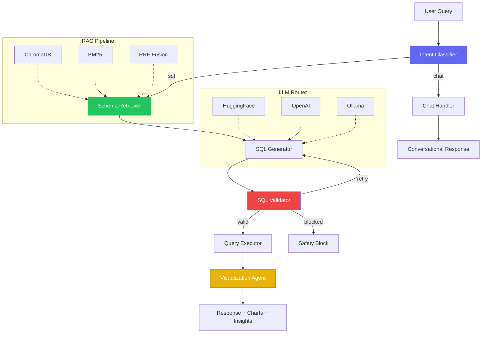

# PlainSQL — Production Text-to-SQL System

> Multi-agent AI pipeline that converts natural language to safe, validated SQL queries — with hybrid RAG, circuit-breaker LLM routing, and real-time streaming.

[](https://github.com/LalitChaudhari851/PlainSQL/actions)


---

## Architecture



### Pipeline Flow

1. **Intent Classification** — Routes queries to chat handler or SQL pipeline
2. **Schema Retrieval** — Hybrid RAG (ChromaDB vector + BM25 keyword + RRF fusion) fetches relevant schema context
3. **SQL Generation** — LLM generates SQL using schema context with few-shot examples and chain-of-thought reasoning
4. **SQL Validation** — Safety layer blocks destructive queries (DROP, DELETE, UPDATE), detects prompt injection, validates syntax
5. **Query Execution** — Read-only execution against MySQL with timeout protection
6. **Visualization** — Auto-generates chart configs, insights, and follow-up suggestions

---

## Features

| Category | Feature | Details |
|---|---|---|
| **Multi-Agent** | 7-node LangGraph pipeline | Conditional routing, retry loops, graceful degradation |
| **LLM Router** | Multi-provider fallback | HuggingFace → OpenAI → Ollama with circuit breaker + 15s deadline |
| **RAG** | Hybrid retrieval | ChromaDB vectors + BM25 keyword + Reciprocal Rank Fusion |
| **Safety** | 4-layer defense | Input validation → Output guardrails → SQL AST validation → EXPLAIN cost check |
| **Streaming** | Server-Sent Events | Agent-stage streaming (intent → SQL → results → insights) |
| **Evaluation** | Custom benchmark | 30+ queries, exact match, execution match, hallucination detection |
| **Guardrails** | Alias-aware schema grounding | Detects hallucinated tables/columns, skips defined aliases |
| **Auth** | JWT + RBAC | Role-based access, rate limiting, env-based admin credentials |
| **Cache** | Redis + in-memory fallback | Tenant-isolated query cache, sorted-set sliding-window rate limiter |
| **Observability** | Per-agent metrics + tracing | structlog, per-node latency histograms, LangSmith, query audit log |
| **Deployment** | Production Docker | Gunicorn workers, Nginx reverse proxy, health checks |
| **Testing** | 81 tests across 5 suites | Security, safety, integration, production hardening, load testing |

---

## Quick Start

### Prerequisites

- Docker & Docker Compose
- An LLM API key (HuggingFace, OpenAI, or local Ollama)

### 1. Clone & Configure

```bash
git clone https://github.com/LalitChaudhari851/PlainSQL.git
cd PlainSQL
cp .env.example .env
# Edit .env with your API keys
```

### 2. Launch

```bash
docker compose -f docker/docker-compose.yml up --build
```

### 3. Access

| Service | URL |
|---|---|
| **Frontend** | http://localhost:3000 |
| **API Docs** | http://localhost:8000/docs |
| **Health** | http://localhost:8000/api/v1/health |

### Local Development (without Docker)

```bash
# Backend
cd backend
pip install -r requirements.txt
uvicorn app.main:app --reload --port 8000

# Frontend is served by FastAPI at http://localhost:8000
```

---

## API Reference

### Chat (Legacy — Frontend)

```bash
curl -X POST http://localhost:8000/chat \
  -H "Content-Type: application/json" \
  -d '{"question": "Show top 5 employees by salary", "history": []}'
```

### Chat with Streaming (SSE)

```bash
curl -X POST http://localhost:8000/chat/stream \
  -H "Content-Type: application/json" \
  -d '{"question": "Total sales revenue by region", "history": []}'
```

### Authenticated API

```bash
# Login
TOKEN=$(curl -s -X POST http://localhost:8000/api/v1/auth/login \
  -H "Content-Type: application/json" \
  -d '{"username": "admin", "password": "admin123"}' | jq -r .access_token)

# Generate SQL
curl -X POST http://localhost:8000/api/v1/generate-sql \
  -H "Authorization: Bearer $TOKEN" \
  -H "Content-Type: application/json" \
  -d '{"question": "Which department has the highest average salary?"}'
```

---

## Project Structure

```
PlainSQL/
├── backend/
│   ├── app/
│   │   ├── agents/           # LangGraph agent nodes (6 agents)
│   │   │   ├── orchestrator.py    # StateGraph DAG builder
│   │   │   ├── intent_classifier.py
│   │   │   ├── schema_retrieval.py
│   │   │   ├── sql_generation.py
│   │   │   ├── sql_validation.py
│   │   │   ├── execution.py
│   │   │   ├── visualization.py
│   │   │   └── guardrails.py      # Output guardrails
│   │   ├── api/              # FastAPI routes + middleware
│   │   ├── auth/             # JWT + RBAC
│   │   ├── llm/              # Model router with circuit breaker
│   │   ├── prompts/          # Versioned prompt registry
│   │   ├── rag/              # Hybrid retriever (ChromaDB + BM25)
│   │   ├── security/         # Input validation + injection detection
│   │   └── observability/    # Logging, tracing, metrics
│   ├── evaluation/           # Benchmark dataset + runner + comparator
│   └── tests/
├── frontend/                 # Vanilla JS + CSS (ChatGPT-style UI)
├── docker/                   # Dockerfile, compose, nginx
└── .github/workflows/        # CI/CD pipelines
```

---

## Evaluation

The evaluation pipeline measures SQL generation quality across 30+ benchmark queries:

| Metric | Description |
|---|---|
| **Exact Match** | Normalized SQL string equality |
| **Execution Match** | Result set comparison (order-independent) |
| **Structural Similarity** | Clause-level comparison (SELECT, JOIN, WHERE, GROUP BY) |
| **Hallucination Detection** | Flags references to non-existent tables/columns |

```bash
cd backend
python -m evaluation.runner
```

Compare two evaluation runs:

```bash
python -m evaluation.compare results/baseline_v1.json results/baseline_v2.json
```

---

## Production Hardening

This system has been through a full production readiness process:

### 14-Issue Audit (All Fixed)

| # | Issue | Severity | Fix |
|---|---|---|---|
| 1 | `time.sleep()` blocks thread pool in LLM retries | Critical | Added 15s total deadline per request |
| 2 | Histogram memory grows unbounded | High | Sliding window cap at 10K observations |
| 3 | Guardrail false positives on SQL aliases | High | Alias-aware validation (FROM/JOIN/AS extraction) |
| 4 | LLM can override intent classifier | Medium | Removed chat override in LLM refinement |
| 5 | EXPLAIN doubles every DB request | Medium | Conditional: only for queries without WHERE |
| 6 | User store lost on restart | High | Documented as demo limitation |
| 7 | `/chat` endpoint has no auth | High | JWT verification added |
| 8 | tenant_id not enforced on DB | Medium | Documented as single-tenant |
| 9 | SQL regex matches prose text | Medium | Requires `SELECT...FROM` structure |
| 10 | ChromaDB write race on multi-worker | Medium | File lock via `filelock` |
| 11 | Hardcoded admin password | Medium | Loaded from env var, blocked in production |
| 12 | Rate limiter memory leak | Low | Periodic dead-key cleanup |
| 13 | `get_sample_values` injectable | Low | Identifier regex validation |
| 14 | `_app_state` thread safety | Low | Documented as write-once |

### SRE Validation

| Scenario | Result |
|---|---|
| 10 concurrent users | ✅ 2-4s response, all resources at 25% |
| 100 concurrent users | ⚠️ Thread pool saturates, graceful degradation |
| LLM provider failure | ✅ Circuit breaker → graceful error |
| Database exhaustion | ✅ Timeout → error message, no crash |
| Redis failure | ✅ Cache misses handled, fails open |

### Load Testing

```bash
cd backend
locust -f tests/load/locustfile.py --host=http://localhost:8000
```

---

## Design Decisions

| Decision | Rationale |
|---|---|
| **LangGraph over LangChain chains** | StateGraph enables conditional routing, retry loops, and graceful degradation — impossible with linear chains |
| **Hybrid RAG (vector + keyword)** | Pure vector search misses exact column names; BM25 catches them. RRF fusion balances both |
| **Circuit breaker on LLM calls** | Prevents cascading failures when an LLM provider is down; auto-fallback to next provider |
| **Synchronous validation agent** | SQL must be validated before execution — this is a hard safety boundary, not a performance optimization |
| **Prompt versioning** | Enables A/B testing prompts and measuring impact on SQL accuracy via the evaluation pipeline |
| **Output guardrails** | LLMs hallucinate table/column names; schema grounding catches this before query execution |

---

## Tech Stack

| Layer | Technology |
|---|---|
| **Backend** | Python 3.11, FastAPI, Pydantic |
| **Agents** | LangGraph StateGraph, LangChain |
| **LLMs** | HuggingFace, OpenAI, Anthropic, Ollama |
| **RAG** | ChromaDB, BM25 (rank_bm25), RRF |
| **Database** | MySQL 8.x, SQLAlchemy |
| **Auth** | JWT (PyJWT), bcrypt, RBAC |
| **Observability** | structlog, LangSmith, Prometheus |
| **Frontend** | Vanilla JS, CSS, Chart.js |
| **Deployment** | Docker, Nginx, Gunicorn + Uvicorn |
| **CI/CD** | GitHub Actions, Ruff, Safety |

---

## License

MIT
